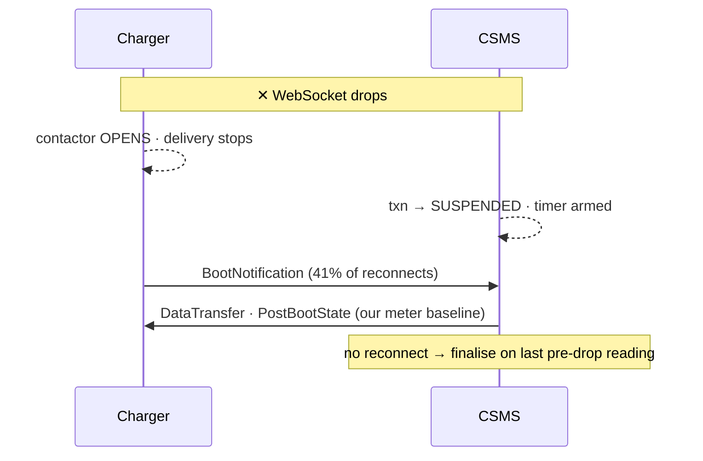
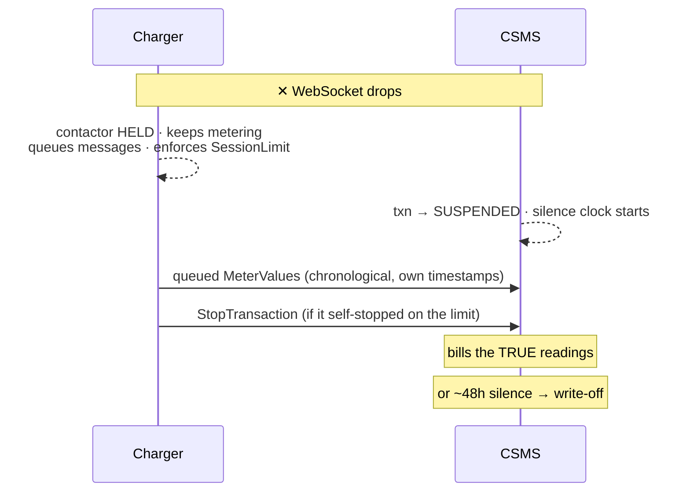
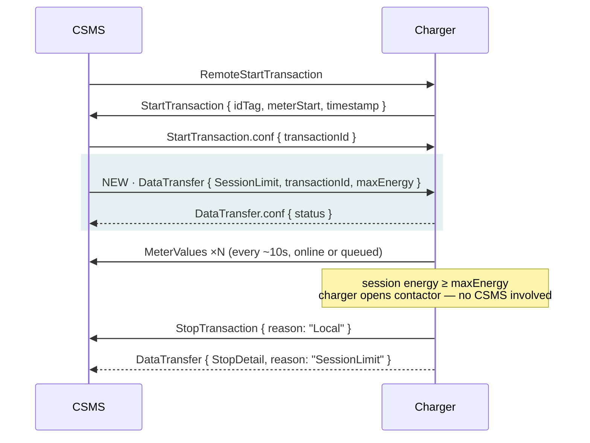

# Offline Continuity — Technical Brief

**VoltLync CSMS & AC Charge Point · OCPP 1.6J · 9 September 2026**

Moving authority for an in-flight charging session from the CSMS to the charger. This
covers what changes on the wire, in the backend, and in the schema — plus the six firmware
requirements and the one gate that must not be got wrong.


---

## 1. Summary

Today a charger opens its contactor when the OCPP WebSocket drops. Charging stops; the CSMS
suspends the transaction and force-finalises it after a timeout, billing against the last
`MeterValues` frame it saw. On a fleet behind carrier NAT with cellular modems, a network
blip ends a customer's overnight charge.

After this change, **WebSocket loss no longer opens the contactor**. The charger keeps
delivering, keeps metering, queues its transaction-related messages per the OCPP 1.6 offline
rules, and enforces a per-session energy budget locally. Safety supervision — earth fault,
leakage, over/under voltage, over-current — is untouched, as none of it ever consulted the
CSMS.

### Already shipped — migration 62, PR #75

**Duplicate-session gap closed.** `_create_qr_payment_locked` filtered only
`RUNNING/STARTED/PENDING_START`, so a payment arriving on a charger with a `SUSPENDED`
transaction saw it as free and could open a parallel session on physically busy hardware.
That guard and `_reconcile_existing_open_transaction` now share
`models.OPEN_TRANSACTION_STATES`. `PENDING_STOP` stays excluded — superseding a transaction
mid-stop races the StopTransaction path into a double-finalise.

**Charger-reported timestamps retained.** `MeterValue.measured_at`,
`Transaction.reported_start_time`, `Transaction.reported_end_time`. The existing
`created_at` / `start_time` / `end_time` keep their meaning as *server receipt* and remain
the billing basis. Parsing goes through `utils.parse_ocpp_timestamp()` with a
clock-plausibility guard; reads go through `services/meter_readings.py`. This had to land
first: the two clocks are milliseconds apart today and hours apart once chargers replay
queued frames.

---

## 2. Message flow — disconnect and reconnect

The CSMS's disconnect handling barely changes. What changes is that energy keeps flowing,
the readings arrive later, and we stop pushing our own meter baseline at a device that now
knows better.

### Today



### After



`PostBootState` is no longer sent — the charger now holds better data than we do. Removal is
gated on fleet rollout (see §6, Gate 3).

The write-off branch is the accepted cost: if a charger goes offline, keeps charging and
never returns, we close the session on the last reading we saw and refund on that basis. The
loss is bounded per session by the customer's prepayment, and only applies to sessions that
go quiet and stay quiet.

---

## 3. Message flow — the new SessionLimit exchange

OCPP 1.6 has no native per-transaction energy limit. `SetChargingProfile` constrains power
over a schedule, not cumulative energy, and `MaxEnergyOnInvalidId` is a station-wide
constant. So this is a vendor `DataTransfer` — the extension point the spec provides for
exactly this case.



Two things worth flagging to the firmware team:

- The limit is anchored to `transactionId` from `StartTransaction.conf`, **not** to `idTag`.
- OCPP 1.6 gives `StopTransaction` no energy-budget reason code, so the stop uses `Local` and
  a follow-up `StopDetail` carries the real cause. Without it, a budget stop is
  indistinguishable from a user pressing stop.

---

## 4. Backend changes by component

Six items, no interdependencies between them, schedulable by availability.

| # | Component | Change |
|---|---|---|
| **01** | `on_stop_transaction` | Add the terminal-state guard it currently lacks. Today it unconditionally overwrites `end_meter_kwh`, `energy_consumed_kwh`, `end_time` and status, then re-runs billing. The money paths are individually idempotent so there is no double refund — but the row is rewritten, leaving an issued invoice disagreeing with its own transaction. Charger figures go to new `reported_*` energy columns plus an audit + alertable event. The same guard covers `MeterValues` replayed for a terminal transaction: acknowledged and stored, never billed, never resumed, never budget-checked. **Hard gate for all firmware work.** |
| **02** ✅ 2026-09-15 | `disconnect_handler`, `transaction_finalizer` | One derived silence clock (`last_heard_at`) shared by the single suspend timer (`hold_until_silent`, self-re-arming), the stale sweep and the staleness guard. Finding: readings already reset the clock via resume-and-re-suspend, so this was structural. Heartbeats / bare reconnects do not extend the window; Boot does, flap-capped. ADR 0022 invariant preserved per row. No column. |
| **04** ✅ 2026-09-15 | `services/session_limit_service.py`, `main.py`, `routers/ocpp_ws.py` | Emit the `SessionLimit` DataTransfer after `StartTransaction.conf`; re-assert on WebSocket connect (not only Boot) for every open transaction; re-push on budget change. Route the charger's `StopDetail` DataTransfer so a budget-cap stop is distinguishable from a user stop. Wh conversion rounds **down**. Server-side `check_budget_and_auto_stop` retained as a redundant failsafe. Includes simulator support and the wire spec. |
| **05** ✅ 2026-09-15 | `services/meter_monotonicity.py`, `on_meter_values` | Compare each reading against the last for that transaction; a backwards reading emits an alertable event and still bills as reported. No clamping — the meter is the instrument of record. |
| ~~**06**~~ descoped 2026-09-15 | — | Offline start is impossible by construction (no local start path, no `Authorize` handler, sessions begin only by `RemoteStartTransaction`). No per-charger configuration from the CSMS. Revisit only if firmware gains a local start path. |
| **10** | Logs Console + CSV export | Extract the frame timestamp from the stored payload at render — no schema change, no index. `OCPPLog.timestamp` is `auto_now_add`, i.e. receipt time despite the name; a replayed queue currently exports as hundreds of identical timestamps. |

### Blocked on a decision

| # | Change | Blocked by |
|---|---|---|
| **03** ✅ 2026-09-15 | `policy.py`: 48h latched / 12h unlatched; no hard ceiling. ADR 0027 amended with the 90-day evidence. | — |
| **07** | Firmware requirements spec **written 2026-09-15**: `docs/firmware/offline-continuity-required-changes-v1.0.md` + `session-limit-spec.md` | firmware review meeting |
| **08** | Remove `_push_post_boot_state`, `after_boot_notification`, `_handle_get_last_meter_value`, `_get_charger_last_meter_wh` | whole-fleet firmware rollout |
| **09** | Customer sub-state in `qr_session_state` + `/api/users/active-session` | product decision |

---

## 5. Database changes

All additive and nullable, Aerich-generated. Existing columns keep their meaning.

| Migration | Columns | Notes |
|---|---|---|
| **62**| `meter_value.measured_at`<br>`transaction.reported_start_time`<br>`transaction.reported_end_time` | Three plain `ADD COLUMN`s — **no index, no deploy lock.** An index on `measured_at` was added then removed: reads order by `COALESCE(measured_at, created_at)` and a btree index on one column cannot serve that expression. Verified on a 20k-row probe with `enable_seqscan=off` — the planner still full-scanned. |
| **64** shipped 2026-09-15 | `transaction.reported_end_meter_kwh`<br>`transaction.reported_energy_kwh` | Item 01. Holds what a late `StopTransaction` (or replayed `MeterValues`) reports without disturbing the billed figures or the issued GST invoice. Two plain `ADD COLUMN`s. (63 was taken by the connector-type check.) |
| **65** shipped 2026-09-15 | `transaction.stop_detail_reason` | Item 04. The charger's StopDetail reason (e.g. `SessionLimit`), beside the OCPP `stop_reason`. One `ADD COLUMN`. |
| ~~**64**~~ dropped | ~~last-contact timestamp on `transaction`~~ | Item 02 no longer needs a column: a `transaction` write per `MeterValues` frame is the wrong trade on the highest-frequency path. Silence is derived from `suspended_at`, the latest `MeterValue.created_at` and `start_time`, as `is_resume_too_stale` already does. See issue 02. |

---

## 6. The wire contract we need from firmware

Four of these six differ from the firmware team's draft HLD. Each difference exists because
the draft's version fails in a specific, identifiable way — this is a review to book, not a
document to send.

### SessionLimit — CSMS to charger

```json
[2, "<uuid>", "DataTransfer", {
  "vendorId":  "VoltLync",
  "messageId": "SessionLimit",
  "data": {
    "transactionId": 8814,
    "maxEnergy": 22000,
    "maxCost": null,
    "maxTime": null
  }
}]
```

`transactionId` — not `idTag`. `maxEnergy` in Wh, absolute, rounded **down**. `maxCost` and
`maxTime` are reserved to mirror the OCPP 2.1 `TransactionLimit` shape; drop them if we do
not want to signal that intention.

### Requirements

| Requirement | Rationale | Status |
|---|---|---|
| **Hold the contactor on WS loss** | Safety paths unchanged and still stop the charge. Only a reset whose sole cause is CSMS unreachability is suppressed. | Agreed |
| **Enforce `maxEnergy` locally** | Continuity without a local cap is unbounded free energy. **Ships in the same release as the item above — never separately.** | Agreed |
| **Key on `transactionId`, not `idTag`** | The HLD keys on `idTag`. `rfid_card_id` is a per-`User` value minted once and reused across every session that customer ever has — it cannot identify a session, and the ambiguity worsens against a limit persisted in EEPROM across reboots. | **Change** |
| **Name the retry cadence by `TransactionMessageAttempts` / `TransactionMessageRetryInterval`** | The HLD hardcodes "3 attempts, then 3 every 30 min". Keep the values fleet-wide in firmware (the CSMS does not set per-charger configuration, decided 2026-09-15) but expose them under the standard key names so the behaviour is legible to any OCPP tooling. | **Minor** |
| **Torn-write durability on the stored meter value** | Rotate across live-state slots, checksum each record, take the newest valid on boot. The failure mode is a power cut landing mid-write — the exact event the value exists to outlive. Retiring `PostBootState` makes this the *sole* meter-recovery path. | **Change** |
| **Never report a reading below one already sent** | The HLD promises the register will not reset within a transaction. It cannot: an involuntary reset is what happens when the meter chip loses power, and a site power cut resets it *and* drops the link together. The achievable invariant is about the wire, not the hardware — reconstruct before reporting. | **Change** |

### The measured failure the last one prevents

A fleet sweep over every disconnect-finalised session in production history — 11 sessions,
6 chargers — found **8 flat, 3 reboot-resets, 0 advanced**. Roughly one in four
reboot-involved sessions came back with the register reset. Chronologically perfect replay,
arithmetically wrong result:

```
meterStart  11,000 Wh
            14,200 Wh
            ── power cut · register resets ──
               900 Wh   ← meterStop

energy = 0.9 − 11.0 = −10.1 kWh
```

---

## 7. Release gates

1. **Gate 1 — item 01 before any firmware release.** ✅ **Satisfied 2026-09-15** (migration 64, `test_late_stop_terminal_guard.py`). The only hard ordering constraint.
   Without it, late-arriving stops rewrite invoiced sessions and the GST register stops
   reconciling against its own transactions. There is no credit-note mechanism to repair
   that after the fact.
2. **Gate 2 — firmware continuity and the local cap ship together.** One release, never two.
3. **Gate 3 — item 08 only after a fleet audit.** Current firmware depends on the
   `PostBootState` push to restore its register; removing it early reintroduces the
   `meterStart = 0` fault that turned a phantom 158 kWh into a full-value charge on
   production transaction 1377.

Item 04 is worth starting early despite firmware not existing: it is fully exercisable
against the charger simulator, and building it produces the wire spec item 07 needs.

---

## 8. Decisions outstanding

| Decision | Detail | Owner | Blocks |
|---|---|---|---|
| ~~**Unlatched suspend window value**~~ | **Decided 2026-09-15: 12 h** (latched 48 h). 90-day sweep: 93% of unlatched outages back within 12 h, all within 48 h. No hard session-age ceiling. | — | — |
| **Firmware sign-off on the four changes** | Two of them — the `transactionId` keying and the retry-key change — alter what our backend sends, so a counter-proposal comes back into our scope. | Firmware team | 07 → 08 |
| **Fleet rollout confirmation** | A status check, not a coding task: every connected charger must be running firmware that persists its own meter state before the recovery messages are removed. | Operations | 08 |
| **Customer-facing session state** | `SUSPENDED` currently surfaces as **PAUSED**. Under continuity that describes an actively charging vehicle. The honest difficulty: we do not *know* the charger is delivering, only that it probably is — so the label must not claim more certainty than we have. | Product | 09 |

---

## 9. Risks

| Risk | Impact | Handling |
|---|---|---|
| **Firmware ships before item 01 is live** | High | Late-arriving charger data silently rewrites invoiced sessions, leaving the tax register inconsistent with its own transactions. Mitigated by treating item 01 as a hard release gate. |
| **Recovery messages removed too early** | High | Any charger not yet upgraded loses its meter reading after a restart. Has already happened once (txn 1377) and produced a wrongly charged customer session. Gated on a fleet audit, not a date. |
| **Charger clocks unreliable** | Medium | Known behaviour on this hardware — the reason ADR 0030 reconstructs Diagnostic Bundle time from in-band `TIME_SYNC` anchors. Already handled: every charger timestamp is validated, with fallback to receipt time. Shipped 9 Sep. |
| **Firmware rejects one of the four changes** | Medium | Two would change what our backend sends. Surfaced early by making sign-off its own tracked item rather than an assumption inside firmware delivery. |
| **Customers see "Paused" while charging** | Low | Support-load and trust risk rather than technical. Needs the product decision above before firmware reaches customers. |

---

*Decision record: ADR 0031 — charger-authoritative offline session. Amends ADR 0027, inverts
ADR 0022's fleet finding. Shipped 9 Sep 2026: migration 62, PR #75, 173 tests green across
12 suites.*
