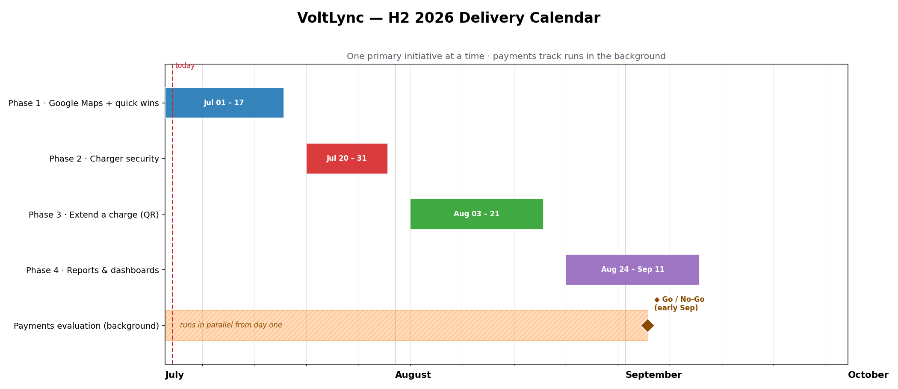

# VoltLync — What We're Building (Second Half of 2026)

_A plain-language summary of our delivery plan, for planning and stakeholder conversations._
_Companion to the detailed engineering roadmap. Last updated: 2 July 2026._

---

## The short version

Over the coming months we'll do five things, roughly in this order:

1. **Get our chargers onto Google Maps** so drivers can find them.
2. **Lock down charger security** to protect billing and prevent tampering.
3. **Let customers top up a charge in progress** instead of getting refunded and re-starting.
4. **Give admins and franchisees proper reports and dashboards.**
5. **In the background, investigate a new payments provider** — only if it clearly beats what we have today.

We work on **one main thing at a time** so quality stays high, while slower, externally-dependent items (like the payments talks) run quietly in the background from day one.

---

## Timeline at a glance

_Build work runs July through mid-September; the payments track runs in the background the whole time, with a go/no-go decision in early September. Dates are indicative windows, not fixed deadlines._

| When | Focus |
|---|---|
| **Early–mid July** | Google Maps visibility + two quick franchisee improvements |
| **Late July** | Charger security hardening |
| **Early–mid August** | Let customers extend a charge ("top up") |
| **Late August** | Reports & dashboards for admins and franchisees |
| **Across the whole period** | Payments provider evaluation (decision by early September) |

Each item is built in small, self-contained pieces, so if priorities shift we can absorb the change without stalling everything else.

---

## What each item delivers

### 1. Get on Google Maps _(early–mid July · in progress now)_
Publish our charging network to Google Maps, including live availability (which chargers are free right now).
**Why it matters:** drivers can discover our sites → more footfall and revenue for franchisees.
**Goal:** first charger visible on Google Maps, tested safely before going fully live.

**Two quick wins riding along:**
- **Cleaner franchisee view** — show franchisees the numbers that matter to them (their payout and energy delivered) instead of internal platform figures.
- **Smoother sign-in for staff** — staff who land on the public customer page get a clear path back to their own dashboard.

### 2. Charger security hardening _(late July · high priority)_
Today, anyone who knows a charger's ID could potentially impersonate it — faking sessions, disrupting billing, or knocking a real charger offline. We're closing that gap so every charger must prove it's genuinely itself.
**Why it matters:** protects revenue and billing accuracy, and prevents disruption to live chargers.
**Note:** this is protection, not a new feature. If we judge the risk urgent, we can move it ahead of the Google Maps work.

### 3. Let customers extend a charge _(early–mid August)_
Right now, if a customer wants more charge than they initially paid for, the system rejects the extra payment and refunds them — a frustrating dead end. We'll let them simply **pay again to keep charging**, with no interruption, and automatically refund anything unused.
**Why it matters:** removes a real drop-off point and sells more energy.

### 4. Reports & dashboards _(late August)_
- **For admins:** a new **Reports** area, starting with charger **temperature trends** over time (with high/low/average and downloadable data), and set up to add energy, signal, and revenue reports later.
- **For franchisees:** dashboard graphs showing payouts over time, energy delivered, and settled-vs-pending amounts.

**Why it matters:** historical insight for fleet health and franchisee self-service — fewer support requests.
**Why grouped together:** the admin and franchisee reports share the same underlying engine, so building them side by side is efficient.

### 5. Payments provider evaluation _(background · decision by early September)_
**The problem:** our current provider (Razorpay) sometimes quietly slows down "instant" refunds, which hurts the customer experience. We're evaluating an alternative (Paytm).

**This is an investigation, not a commitment.** We spend money only as long as each checkpoint passes:
- **First and most important:** measure whether the alternative actually gives customers faster, more reliable refunds. If it doesn't clearly win, **we stop here** and instead push our current provider to do better.
- **If it passes:** check whether the alternative can support our franchisee-payout model (requires their team and compliance sign-off).
- **Then:** a formal **go / no-go decision.**

**Honest read:** early research suggests the alternative may be no better on refunds. That's exactly why we test it cheaply before committing — and if it doesn't win, the recommendation is to *not* migrate.

_If we do proceed, the migration itself is a large, separate effort — the biggest cost being re-onboarding every franchisee onto the new system. We'd scope that only after the go decision._

---

## Things to keep an eye on

| Item | The risk | How we're handling it |
|---|---|---|
| **Payments talks** | Depend on the other company's team and compliance | Started early, run in parallel — never block other work |
| **Payments benefit** | The alternative may show no real improvement | Cheap test first; easy to walk away |
| **Charger security rollout** | Existing chargers need new credentials | Rolled out gradually — no "big bang" outage |
| **Google Maps listing** | Once published, our map identity is permanent | Tested on a safe environment before going live |

## How we've chosen to sequence things

- **Finish what's already started** (Google Maps) before opening new fronts.
- **Start slow, externally-dependent clocks early** (payments talks) so they're never the bottleneck.
- **Security can jump the queue** if we judge the risk urgent.
- **Build in small, demoable pieces** so progress is visible and priorities can flex.
- **Group work that shares foundations** (the two reporting efforts) to avoid duplicated effort.
- **Cap spending on uncertain bets** (payments) — stop at the first failed checkpoint.

---

_This is a rolling plan and a set of priorities, not a list of fixed deadlines. Sizes and dates are best estimates and will flex as we learn._
